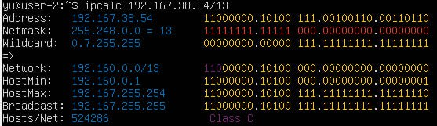
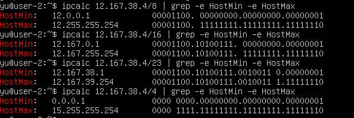
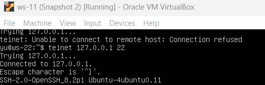

## Part 1. Инструмент ipcalc

#### 1.1. Сети и маски

**Адрес сети 192.167.38.54/13**
>  Адрес сети 192.167.38.54/13 => 192.160.0.0

**Перевод маски**
> 255.255.255.0 => Префиксная: /24 и двоичная запись: 11111111.11111111.11111111.00000000 

>/15 => Обычная: 255.254.0.0  и двоичная: 11111111.11111110.00000000.00000000

>11111111.11111111.11111111.11110000 => Обычная:255.255.255.240 и префиксная:/28

**Минимальный и максимальный хост в сети 12.167.38.4 при масках**
> /8 => Min:12.0.0.1  Max:12.255.255.254

> 11111111.11111111.00000000.00000000 => Min:12.167.0.1 Max:12.167.255.254

> 255.255.254.0 => Min:12.167.38.1 Max:12.167.39.254

> /4  => Min:0.0.0.1 Max:15.255.255.254

#### 1.2. localhost

**Определи и запиши в отчёт, можно ли обратиться к приложению, работающему на localhost, со следующими IP: 194.34.23.100, 127.0.0.2, 127.1.0.1, 128.0.0.1**

>194.34.23.100 - нельзя
> 127.0.0.2 - можно
>127.1.0.1 - можно
> 128.0.0.1 - нельзя

#### 1.3. Диапазоны и сегменты сетей

**Какие из перечисленных IP можно использовать в качестве публичного, а какие только в качестве частных: 10.0.0.45, 134.43.0.2, 192.168.4.2, 172.20.250.4, 172.0.2.1, 192.172.0.1, 172.68.0.2, 172.16.255.255, 10.10.10.10, 192.169.168.1**
>10.0.0.45 - Private
134.43.0.2 - Public
192.168.4.2 - Private
172.20.250.4 - Private
172.0.2.1 - Public
192.172.0.1 - Public
172.68.0.2 - Public
172.16.255.255 - Private
10.10.10.10- Private
192.169.168.1 - Public

**Какие из перечисленных IP-адресов шлюза возможны у сети 10.10.0.0/18: 10.0.0.1, 10.10.0.2, 10.10.10.10, 10.10.100.1, 10.10.1.255**
> 10.0.0.1, 10.10.10.10 и 10.10.100.1 не входят в диапазон адресов данной сети. 

>10.10.0.2 и 10.10.1.255 возможны для сети 10.10.0.0/18.

## Part 2. Статическая маршрутизация между двумя машинами

- С помощью команды ip a просмотрела существующие сетевые интерфейсы

- Содержание изменённого файла etc/netplan/00-installer-config.yaml для каждой машины и выполнение команды netplan apply для перезапуска сервиса сети

#### 2.1. Добавление статического маршрута вручную
- Добавила статический маршрут от одной машины до другой и обратно при помощи команды вида ip r add и пропинговала соединение между машинами

#### 2.2. Добавление статического маршрута с сохранением

- Добавила статический маршрут от одной машины до другой с помощью файла /etc/netplan/00-installer-config.yaml и проверила командой ping  

## Part 3. Утилита iperf3

#### 3.1. Скорость соединения
**Переведи и запиши в отчёт: 8 Mbps в MB/s, 100 MB/s в Kbps, 1 Gbps в Mbps**
>8 Mbps => 8/8 = 1MB/s 

>100 MB/s => 100*1000*8= 800000 Kbps

>1 Gbps => 1*1000 = 1000 Mbps

#### 3.2. Утилита iperf3

**Измерим скорость соединения между ws2 и ws1**
- Запуск программы iperf3 в режиме сервера

- Запуск на другом хосте в режиме клиента

## Part 4. Сетевой экран

#### 4.1. Утилита iptables
- Файл /etc/firewall.sh, имитирующий файрвол на ws2,ws1 со следующими правилами:

>1) На ws1 примени стратегию, когда в начале пишется запрещающее правило, а в конце пишется разрешающее правило (это касается пунктов 4 и 5).

>2) На ws2 примени стратегию, когда в начале пишется разрешающее правило, а в конце пишется запрещающее правило (это касается пунктов 4 и 5).

>3) Открой на машинах доступ для порта 22 (ssh) и порта 80 (http).

>4) Запрети echo reply (машина не должна «пинговаться», т. е. должна быть блокировка на OUTPUT).

>5) Разреши echo reply (машина должна «пинговаться»).

- Запуск файлов на обеих машинах командами chmod +x /etc/firewall.sh и /etc/firewall.sh

> Основное различие между стратегиями заключается в порядке применения правил: в одной стратегии приоритет отдается запрету по умолчанию с последующим разрешением необходимых соединений, а в другой — наоборот. Соответсвенно для первой машины стоит команда reject отклоняющая пакет, таким образом пинг не пройдет, так как имеет больший приоритет. Для второй машины пинг пройдет, так как в начале стоит accept - разрешающая прохождение пакета. Запрещающие правила написанные первыми имеют приоритет выше

#### 4.2. Утилита nmap

- Успешный пинг на ws1

- Пинг не идет с ws2 на ws1

- Утилитой nmap показала, что хост машины запущен (в выводе nmap должно быть сказано: Host is up)

## Part 5. Статическая маршрутизация сети

### Сеть:

 

#### 5.1. Настройка адресов машин

**Выводим содержание файла etc/netplan/00-installer-config.yaml для каждой машины. Перезапускаем сервис сети. Командой ip -4 a проверяем, что адрес машины задан верно**

- Успешный пинг между машинами r1 и ws11

- Успешный пинг между машинами ws22 и ws21

#### 5.2. Включение переадресации IP-адресов
-Для включения переадресации IP выполнила команду на роутерах:
sysctl -w net.ipv4.ip_forward=1

> При таком подходе переадресация не будет работать после перезагрузки системы

- Открыла файл /etc/sysctl.conf и добавила в него следующую строку:
net.ipv4.ip_forward = 1

> При использовании этого подхода, IP-переадресация включена на постоянной основе.
#### 5.3. Установка маршрута по умолчанию

- Настройка маршрута по умолчанию (шлюза) для рабочих станций

- Вызовом ip r  можем увидеть, что добавился маршрут в таблицу маршрутизации

- Пропинговала с ws11 роутер r2 и показала на r2, что пинг доходит с помощью команды:
tcpdump -tn -i eth0

#### 5.4. Добавление статических маршрутов

- Добавила в роутеры r1 и r2 статические маршруты в файле конфигураций

- Вызвала ip r и показала таблицы с маршрутами на обоих роутерах

- Запустила команды на ws11:
ip r list 10.10.0.0/[маска сети] и ip r list 0.0.0.0/0

 

> для адреса 10.10.0.0/[маска сети] был выбран маршрут, отличный от 0.0.0.0/0, так как маршрут был выбран из за большей точности(длина префикса /18). То есть если существует маршрут для конкретной подсети (например, 10.10.0.0), он будет использоваться для трафика к этой подсети вместо общего маршрута по умолчанию (0.0.0.0/0).
(0.0.0.0/0) служит "резервным" маршрутом для всех адресов, которые не попадают под другие правила.

#### 5.5. Построение списка маршрутизаторов

- Запустила на r1 команду дампа:
tcpdump -tnv -i eth0

- При помощи утилиты traceroute построила список маршрутизаторов на пути от ws11 до ws21

> Утилита traceroute использует определённый протокол для отправки последовательности IP-пакетов, обычно это UDP или ICMP. По умолчанию количество отправляемых пакетов ограничено тремя. Каждый следующий пакет отправляется с увеличением значения TTL (Time To Live) на 1: у первого пакета TTL равен 1, у второго — 2 и так далее.
При передаче пакетов от одного маршрутизатора к другому значение TTL уменьшается на единицу, что предотвращает потенциальное бесконечное перемещение пакета между маршрутизаторами. Когда TTL достигает нуля, маршрутизатор уничтожает пакет и отправляет обратно сообщение об ошибке о превышении времени жизни (Time Exceeded).

#### 5.6. Использование протокола ICMP при маршрутизации

- Запустила на r1 перехват сетевого трафика, проходящего через eth0 с помощью команды: tcpdump -n -i eth0 icmp

 - Пропинговала с ws11 несуществующий IP (например, 10.30.0.111) с помощью команды: ping -c 1 10.30.0.111

## Part 6. Динамическая настройка IP с помощью DHCP
- Указала адрес маршрутизатора по умолчанию, DNS-сервер и адрес внутренней сети

- В файле resolv.conf прописала nameserver 8.8.8.8

- Перезагрузила службу DHCP командой systemctl restart isc-dhcp-server

- Машины получили адрес:

- Пинг ws22 с ws21.

- Указала MAC-адрес у ws11, для этого в etc/netplan/00-installer-config.yaml добавила строки: macaddress: 10:10:10:10:10:BA, dhcp4: true

- Настроила dhcp для r1, сделала выдачу адресов с жесткой привязкой к MAC-адресу (ws11)

- В файле resolv.conf прописала nameserver 8.8.8.8 для r1

- Перезагрузила службу DHCP командой systemctl restart isc-dhcp-server для r1

- Новый IP-адрес ws11

 

- Запустила sudo dhclient -r enp0s3, чтобы удалить старый ip

- Запустила sudo dhclient -v enp0s3, чтобы запросить новый ip

- Опции DHCP сервера 
>маска подсети IP

>шлюз

>адрес сервера DNS 

## Part 7. NAT

- В файле /etc/apache2/ports.conf на ws22 и r1 изменила строку Listen 80 на Listen 0.0.0.0:80, то есть сделала сервер Apache2 общедоступным

- Запустила веб-сервер Apache командой service apache2 start на ws22 и r1

- Добавила в фаервол на r2 следующие правила:

>1) Удаление правил в таблице filter — iptables -F;

>2) Удаление правил в таблице «NAT» — iptables -F -t nat;

>3) Отбрасывать все маршрутизируемые пакеты — iptables --policy FORWARD DROP.

- Запуск файла:

- Проверка соединения между ws22 и r1 командой ping.
**При запуске файла с этими правилами, ws22 не должна «пинговаться» с r1**

- Добавила в файл ещё одно правило  - Разрешить маршрутизацию всех пакетов протокола ICMP

- Проверь соединение между ws22 и r1 командой ping.
**При запуске файла с этими правилами, ws22 должна «пинговаться» с r1**

- Добавила в файл ещё два правила:

> Включение SNAT, а именно маскирование всех локальных IPиз локальной сети, находящейся за r2 (по обозначениям из Части 5 — сеть 10.20.0.0).
Совет: стоит подумать о маршрутизации внутренних пакетов, а также внешних пакетов с установленным соединением.

> Включение DNAT на 8080 порт машины r2 и добавить к веб-серверу Apache, запущенному на ws22, доступ извне сети.

- Проверка соединение по TCP для SNAT: для этого с ws22 подключиться к серверу Apache на r1 командой:
telnet [адрес] [порт]

- Проверка соединения по TCP для DNAT: для этого с r1 подключиться к серверу Apache на ws22 командой telnet (обращаться по адресу r2 и порту 8080).

## Part 8. Дополнительно. Знакомство с SSH Tunnels
- Запустили на r2 apache2

- Запустили веб-сервер Apache на ws22 только на localhost 

- Воспользуемся Local TCP forwarding с ws21 до ws22, чтобы получить доступ к веб-серверу на ws22 с ws21

- Воспользуемся Remote TCP forwarding c ws11 до ws22, чтобы получить доступ к веб-серверу на ws22 с ws11

- Для проверки, сработало ли подключение в обоих предыдущих пунктах, выполнили команду: telnet 127.0.0.1 [локальный порт]

